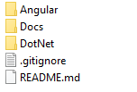

# BIA Framework

## New Project

If you want to start a new project, you have to create the Frontend and/or the Backend project(s) depending on your needs.

You have to respect the structure below (same as BIADemo) for your project :  

To accomplish this, follow the steps below in the right order : 
1. Clone the Git repository from Azure DevOps.
2. In your project folder copy the .gitignore file you can find at the root of the BIADemo project.
3. Create the README.md file that will be the entry point for your documentation, and the Docs folder that will contains others .md files.
4. Create the Angular folder and follow the steps on [this page](../Angular/docs/NEW_PROJECT.md).
5. Create the DotNet folder and follow the steps on [this page](../DotNet/Docs/NEW_PROJECT.md).

Your should now be able to launch you project !