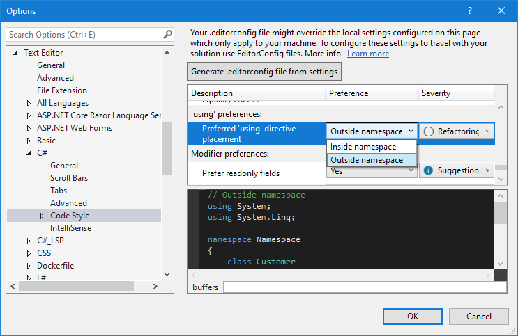

# Configure your development environment:

## Minimum requierement

### Visual Studio 2019 & components
**Installation :**

Install [Visual Studio 2019](https://visualstudio.microsoft.com/fr/vs/) and be sure to add the latest SDK of .NET Core from the components list.
Add those components during installation :
- [Git for Visual Studio](https://subscription.packtpub.com/book/programming/9781789530094/9/ch09lvl1sec71/installing-git-for-visual-studio-2019)
- [Development Time IIS Support](https://devblogs.microsoft.com/aspnet/development-time-iis-support-for-asp-net-core-applications/)

If Visual Studio 2019 is already install, you can add thoses component by launching the VS Installer.

**Configuration :**

Set your “using placement” code style setting to “inside namespace” 
Code style settings are available from Tools > Options > Text Editor > C# > Advanced > Code Style.


### Variable Environment
create the following system environment variable:  
Name: ASPNETCORE_ENVIRONMENT  
Value: Development  

## TheBIADevCompany Customisation

### Configuration for the TheBIADevCompany proxy
[Add the following **User** environment variables :](https://www.tenforums.com/tutorials/121664-set-new-user-system-environment-variables-windows.html#option1)  
* HTTP_PROXY: http://10.179.8.30:3128/
* HTTPS_PROXY: http://10.179.8.30:3128/
* NO_PROXY: https://tfsdm.eu.labinal.snecma

### Git config
To find the path to the **.gitconfig** file, type the following command:  
`git config --list --show-origin`  

Open your **.gitconfig** file (usualy located in your user folder) and add this configuration:
```
[http "https://tfsdm.eu.labinal.snecma/"]
                sslVerify = false
                proxy = ""
[http "https://azure.devops.thebiadevcompany/"]
                sslVerify = false
                proxy = ""
```
